# 🚜 Boerderij Simulator 50


Jeu de simulation de conduite de tracteurs en 3D — **interface du jeu en néerlandais** — conçu pour
**Android d'abord** (via Capacitor), puis iOS. Jouable aussi directement dans un navigateur.

> Image de présentation générée à partir des prompts du [press kit](docs/presskit.html).

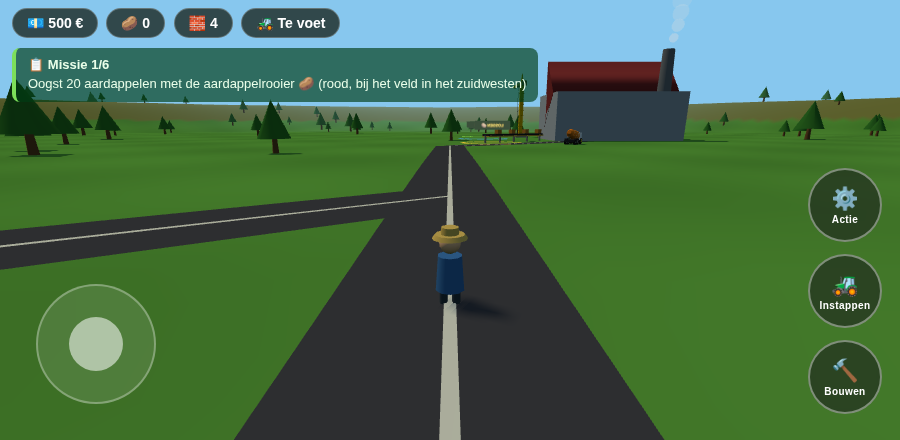

## Contenu du jeu

| Véhicule / machine | Nom en jeu | Rôle |
|---|---|---|
| 🚜 Tracteur | Tractor | Conduite libre, réaliste (roues crantées, cabine vitrée, garde-boue) |
| 🥔 Arracheuse | Aardappelrooier | Récolte auto — 🥔 pommes de terre, 🌾 blé, 🌽 maïs — trémie qui se remplit |
| 🚛 Camion-toupie | Betonmixer | Toupie tournante, coule des dalles de route sur les fondations |
| 🚧 Pelleteuse | Graafmachine | Chenilles, bras articulé animé, creuse les fondations de routes |
| 🏗️ Grue à tour | Kraan | Rotation de flèche, chariot, crochet ; charge les caisses (machine de chargement) |
| 🛥️ Bateau | Boot | Navigation sur le lac, mission vers l'île au drapeau |

- 🏭 **Usine** avec cheminée fumante, **convoyeur animé** (machine de déchargement), zone
  jaune *LOSSEN* (vendre les pommes de terre) et zone bleue *LADEN* (acheter des matériaux).
- 🔨 **Construction** : maisons, hangars et **tracteurs personnalisés** à assembler soi-même
  (menu *Bouwen*), routes à construire soi-même (pelleteuse → fondation, toupie → béton).
- 🌾 **Trois cultures** : pommes de terre 🥔, blé 🌾 et maïs 🌽, chacune dans son champ, à
  récolter et vendre à l'usine à prix fixe (2 / 3 / 4 € l'unité). **Routes goudronnées**
  reliant les champs au réseau routier.
- 🛒 **Marché** (Markt) : stand avec panneau des **prix qui fluctuent** en temps réel
  (flèches de tendance ▲▼). Choisissez de vendre au prix fixe garanti de l'usine, ou de
  tenter le marché quand les cours grimpent.
- 🐄 **Animaux vivants** : vaches et moutons dans des enclos clôturés (ils broutent et se
  promènent), poules 🐔 en basse-cour avec poulailler — elles s'enfuient quand on s'approche.
- 🌙 **Cycle jour/nuit** (journée de 5 min) : soleil orbital, aube et crépuscule colorés,
  ciel étoilé la nuit, horloge dans le HUD — et **phares** : lampes allumées sur tous les
  véhicules la nuit, vrais faisceaux lumineux sur le véhicule conduit.
- 🔊 **Sons synthétisés** (Web Audio, aucun fichier) : moteur lié au régime, meuglements,
  bêlements, caquètements avec atténuation par distance ; bouton 🔊/🔇 dans le HUD.
- 🌧️ **Météo dynamique** : alternance aléatoire clair / pluie / brouillard avec transitions
  douces — gouttes qui suivent le joueur, bruit de pluie, nappe de brouillard qui réduit
  la visibilité ; indicateur ☀️/🌧️/🌫️ dans le HUD.
- ⭐ **Niveaux & expérience** : gagnez de l'XP en récoltant, vendant, livrant, construisant et
  bâtissant des routes ; montez de niveau (barre d'XP + badge dans le HUD), débloquez des
  titres (Leerling → Boerenkoning) et touchez une prime d'argent à chaque palier.
- 📊 **Tableau des scores** (bouton 📊 du HUD) : score total (XP cumulée), niveau/titre et
  toutes les statistiques — récoltes, ventes, argent gagné, caisses, routes, bâtiments, missions.
- 📋 **6 missions** guidées, économie (💶 argent, 🥔 pommes de terre, 🧱 matériaux).
- 📱 **Contrôles tactiles** (joystick virtuel + boutons) et clavier (flèches/WASD/ZQSD,
  Espace = action, E = monter/descendre, B = construire).

| | | |
|---|---|---|
| 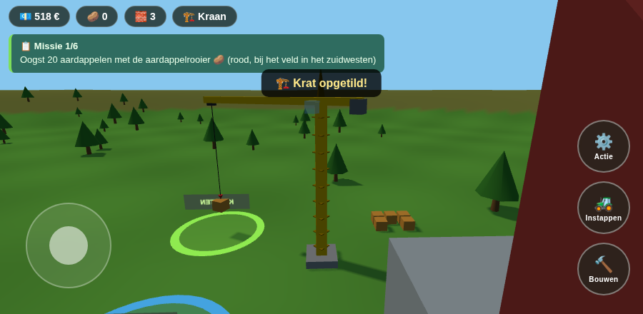 | 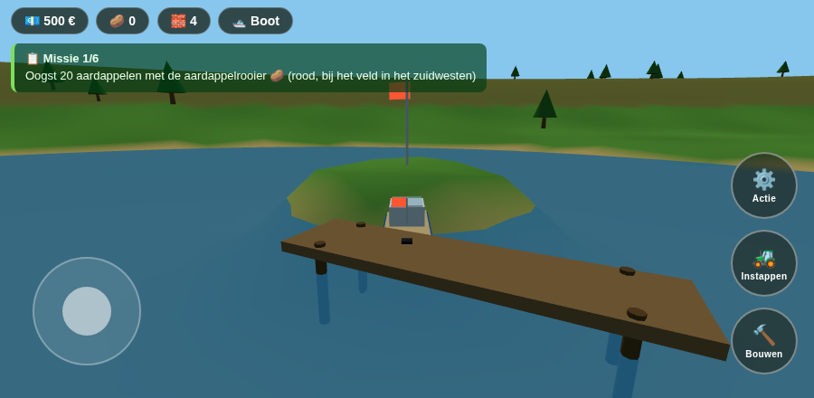 | 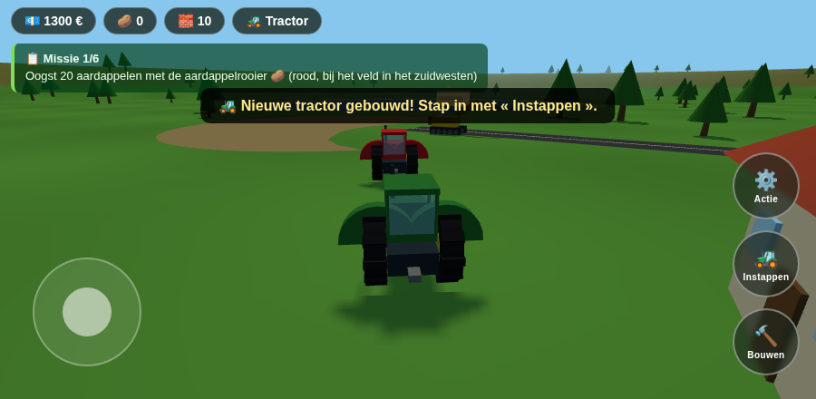 |

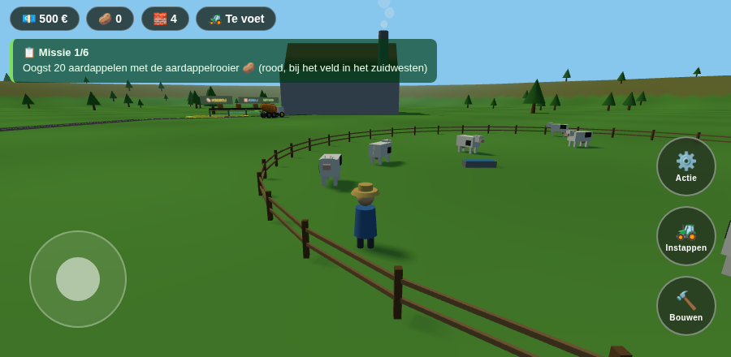

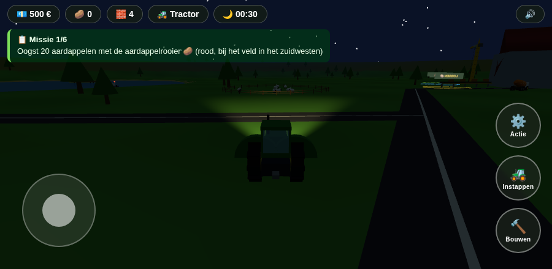

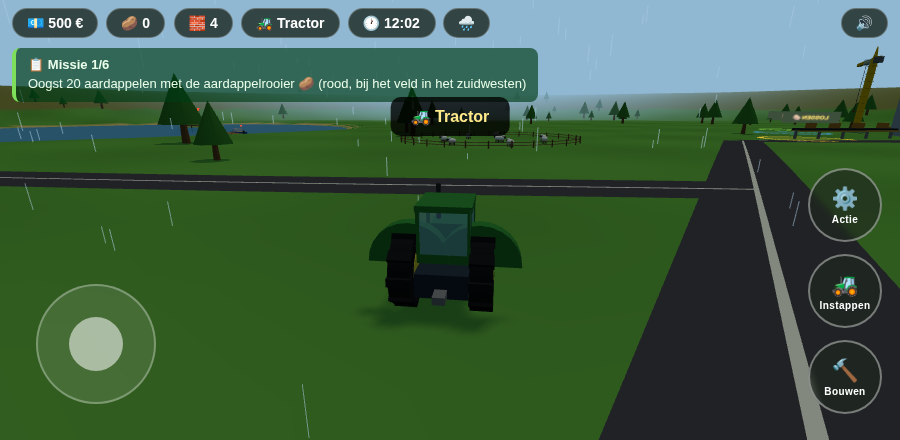

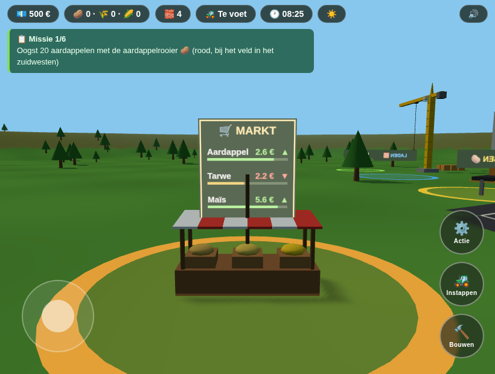

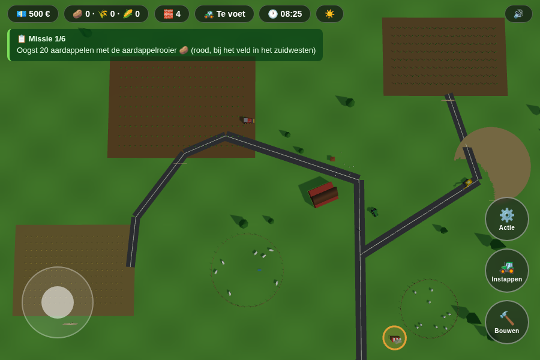

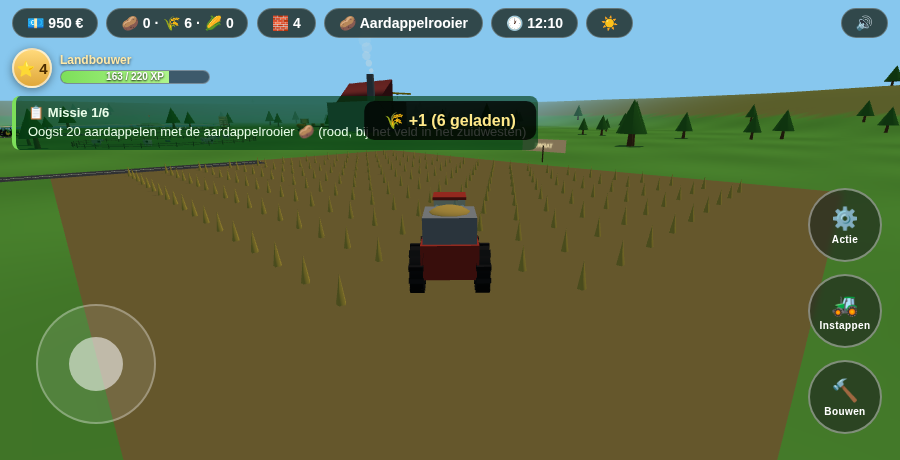

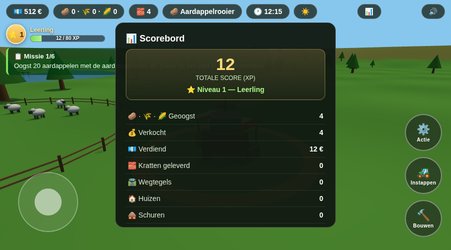

## Lancer en développement (navigateur)

```bash
npm install
npm run dev        # http://localhost:5173
```

## Build Android (Capacitor)

Prérequis : Android Studio + SDK installés.

```bash
npm install
npm run android:init    # une seule fois : crée le dossier android/
npm run android:sync    # build web + synchronisation vers le projet Android
npm run android:open    # ouvre Android Studio → Run ▶ sur un appareil/émulateur
```

Pour générer un APK/AAB signé : Android Studio → *Build → Generate Signed Bundle/APK*.

## iOS (plus tard)

```bash
npm install @capacitor/ios
npx cap add ios
npm run build && npx cap sync ios
npx cap open ios        # nécessite un Mac avec Xcode
```

## Architecture

- `src/terrain.js` — terrain analytique (collines, lac, île) partagé entre rendu et physique
- `src/world.js` — monde 3D : champ, usine, convoyeur, zones, chantier, pontons, arbres
- `src/vehicles.js` — tous les véhicules (modèles low-poly + conduite arcade)
- `src/main.js` — état du jeu, missions, économie, caméra, boucle de rendu
- `src/controls.js` — clavier + joystick tactile
- `src/ui.js` — HUD, missions et menu de construction (textes néerlandais)

Moteur : [Three.js](https://threejs.org/) · Packaging mobile : [Capacitor](https://capacitorjs.com/)

> ℹ️ Le jeu s'appelle *Boerderij Simulator 50* (« Farming Simulator » est une
> marque de GIANTS Software, d'où ce nom distinct).
